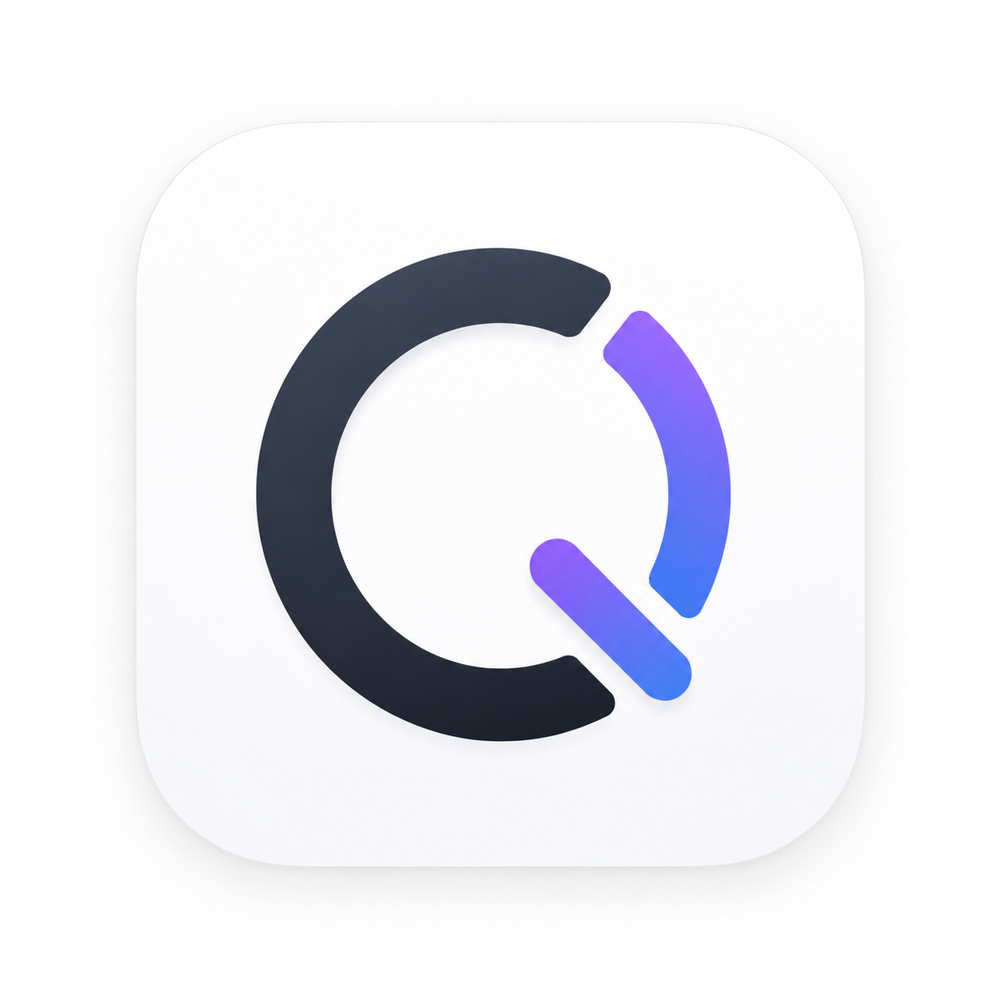
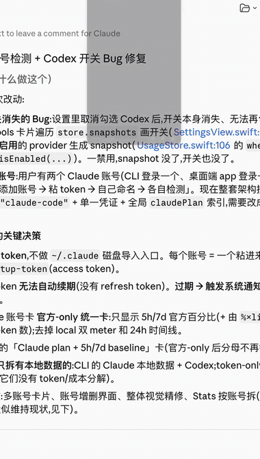
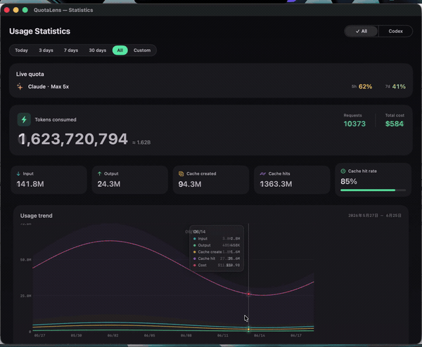
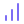

<div align="center">



# QuotaLens

**See your AI usage clearly.** A macOS menu-bar gauge for **Claude** and **Codex** quotas.


<br />



**English** · [简体中文](#-简体中文)

</div>

---

##  Overview

QuotaLens lives in your menu bar as a small ring + percentage of your highest current
usage. Click it for a panel with per-source cards — the authoritative 5-hour / 7-day
limits, the current session, and a 24-hour timeline. A separate statistics window breaks
down tokens, cost, and cache over any time range.

It tracks two tools side by side:

- **Claude** — one card per account, each probed with its own `claude setup-token`.
- **Codex** — read locally from `~/.codex/sessions`, no network.

<div align="center">
  
</div>

##  Features

| |  Claude |  Codex |
|---|:---:|:---:|
| Live 5h / 7d quota | ✓ &nbsp;official probe | ✓ &nbsp;official (local file) |
| Multiple accounts | ✓ &nbsp;one token each | single (local login) |
| Token / cost history | ✓ &nbsp;CLI account | ✓ |
| Network use | tiny probe, throttled | none |

- **Multiple Claude accounts** — add each with its own token; every account is its own
  card. Up to 4 sources total.
- **Authoritative limits** — Claude reads the real `anthropic-ratelimit-unified-*`
  headers; Codex reads its official `rate_limits` from local rollout files.
- **Token-expiry alerts** — a pasted token can't auto-renew, so when one expires the card
  flags it and you get a notification to re-paste.
- **Statistics window** — tokens / cost / cache with a smooth multi-series trend chart.
  Pick Today / 3d / 7d / 30d / All or a custom range; short ranges render hourly. Hover for
  per-point detail. Everything stays in sync with your configured sources.
- **Launch at login** — optional, via `SMAppService`.

[## Star History

<a href="https://www.star-history.com/?repos=mangiapanejohn-dev%2FQuotaLens&type=timeline&logscale=&legend=top-left">
 <picture>
   <source media="(prefers-color-scheme: dark)" srcset="https://api.star-history.com/chart?repos=mangiapanejohn-dev/QuotaLens&type=timeline&theme=dark&logscale&legend=top-left" />
   <source media="(prefers-color-scheme: light)" srcset="https://api.star-history.com/chart?repos=mangiapanejohn-dev/QuotaLens&type=timeline&logscale&legend=top-left" />
   
 </picture>
</a>

##  Install

**Homebrew:**

```sh
brew tap mangiapanejohn-dev/tap
brew install --cask quotalens
```

**Build it yourself** (skips Gatekeeper notarization entirely):

```sh
git clone https://github.com/mangiapanejohn-dev/QuotaLens.git
cd QuotaLens
make install      # builds and copies QuotaLens.app to /Applications
```

Or download `QuotaLens.dmg` from the [latest release](https://github.com/mangiapanejohn-dev/QuotaLens/releases/latest).

Or produce a drag-to-install disk image:

```sh
brew install create-dmg
make dmg           # writes build/QuotaLens.dmg
```

**Requirements:** macOS 13+, the Swift 6 toolchain (Xcode 16+).

##  Adding accounts

1. In a terminal, run `claude setup-token` for the account you want to track and copy the token.
2. Open QuotaLens → the gear icon → **Sources** → **Add Claude account**, give it a name
   (e.g. `Pro`, `Max 5x`) and paste the token.

Codex needs no setup — it reads `~/.codex/sessions` automatically. When a token expires,
the card turns red; use **replace token** on that account to paste a fresh one.

##  How it works

| Source | What it reads | Network |
|---|---|---|
| Claude live quota | `anthropic-ratelimit-unified-*` response headers, per token | one `max_tokens: 1` request per account, ≤ once / 5 min |
| Codex live quota | official `rate_limits` in `~/.codex/sessions/**/*.jsonl` | none |
| Statistics | token / cost from local Claude & Codex JSONL logs | none |

The statistics window reflects **only the sources you've configured** — no Claude account
means no Claude data, so the panel never shows numbers you didn't set up.

##  Privacy

Everything runs locally. The only network call is the Claude probe — a minimal, throttled
request used solely to read the rate-limit headers. Tokens are stored locally in
`UserDefaults`. Nothing is sent anywhere else.

##  Make targets

```sh
make run        # build, bundle, and launch QuotaLens.app
make install    # build + copy to /Applications
make dmg        # drag-to-install DMG (needs create-dmg)
make icon       # regenerate AppIcon.icns from Resources/AppIconSource.png
make test       # run the unit tests
```

The official Claude / Codex marks shown on the source cards are pulled from your locally
installed `Claude.app` / `Codex.app` at build time (`make logos`) and are **not**
redistributed in this repo; without those apps the UI falls back to SF Symbols.

## License

[MIT](LICENSE). The Claude and Codex names and logos are trademarks of their respective
owners and are used here only to identify the tools being monitored.

---

<a id="-简体中文"></a>

# 简体中文

**一眼看清 AI 用量。** macOS 菜单栏里的 **Claude** / **Codex** 额度表盘。

##  概览

QuotaLens 常驻菜单栏,显示一个圆环 + 当前最高占用的百分比。点开是一个面板,每个来源一张卡:
权威的 5 小时 / 7 天额度、当前会话、24 小时时间线。另有独立的统计窗口,按任意时间范围拆解
token、成本、缓存。

并排追踪两个工具:

- **Claude** —— 每个账号一张卡,各自用自己的 `claude setup-token` 探测。
- **Codex** —— 直接读本机 `~/.codex/sessions`,不联网。

<div align="center">
  
</div>

##  功能

| |  Claude |  Codex |
|---|:---:|:---:|
| 实时 5h / 7d 额度 | ✓ &nbsp;官方探测 | ✓ &nbsp;官方(本地文件) |
| 多账号 | ✓ &nbsp;每账号一个 token | 单一(本地登录) |
| token / 成本历史 | ✓ &nbsp;CLI 账号 | ✓ |
| 联网 | 极小探测、限频 | 不联网 |

- **多 Claude 账号** —— 每个粘一个 token,各成一张卡,整个面板最多 4 个来源。
- **权威额度** —— Claude 读真实的 `anthropic-ratelimit-unified-*` 响应头;Codex 读本地
  rollout 文件里的官方 `rate_limits`。
- **token 过期提醒** —— 粘进来的 token 无法自动续期,过期时卡片标红并发系统通知提醒重新粘贴。
- **统计窗口** —— token / 成本 / 缓存 + 丝滑的多序列趋势图。可选 今天 / 3天 / 7天 / 30天 /
  全部 或自定义区间;短范围按小时绘制;hover 看每个点的明细。数据严格跟你配置的来源同步。
- **开机自启** —— 可选,基于 `SMAppService`。

##  安装

**Homebrew:**

```sh
brew tap mangiapanejohn-dev/tap
brew install --cask quotalens
```

**自行构建**(绕过 Gatekeeper 公证):

```sh
git clone https://github.com/mangiapanejohn-dev/QuotaLens.git
cd QuotaLens
make install      # 构建并把 QuotaLens.app 拷到 /Applications
```

或生成拖拽式安装的磁盘镜像:

```sh
brew install create-dmg
make dmg           # 输出 build/QuotaLens.dmg
```

**环境要求:** macOS 13+,Swift 6 工具链(Xcode 16+)。

##  添加账号

1. 终端里对目标账号运行 `claude setup-token`,复制 token。
2. 打开 QuotaLens → 齿轮图标 → **Sources** → **Add Claude account**,起个名字
   (如 `Pro`、`Max 5x`)并粘贴 token。

Codex 无需配置 —— 自动读 `~/.codex/sessions`。token 过期时卡片标红,在该账号上用
**replace token** 粘一个新的即可。

##  工作原理

| 来源 | 读取什么 | 联网 |
|---|---|---|
| Claude 实时额度 | 每个 token 的 `anthropic-ratelimit-unified-*` 响应头 | 每账号一个 `max_tokens: 1` 请求,≤ 每 5 分钟一次 |
| Codex 实时额度 | `~/.codex/sessions/**/*.jsonl` 里的官方 `rate_limits` | 不联网 |
| 统计 | 本地 Claude / Codex JSONL 日志里的 token / 成本 | 不联网 |

统计窗口**只反映你配置过的来源** —— 没配 Claude 账号就不会出现 Claude 数据,绝不显示你没设置过的数字。

##  隐私

一切都在本地运行。唯一的联网是 Claude 探测 —— 一个极小、限频的请求,仅用于读取额度响应头。
token 本地存于 `UserDefaults`,不向任何其它地方发送。

## License

[MIT](LICENSE)。Claude、Codex 名称及 logo 为各自所有者的商标,此处仅用于标识被监控的工具。
